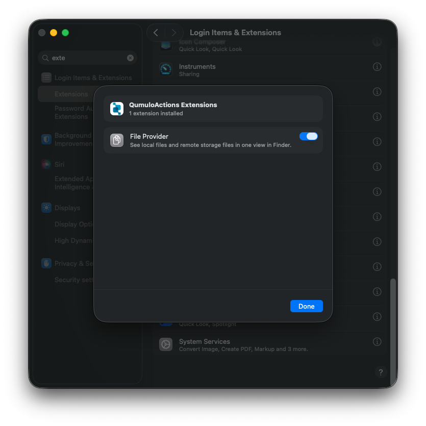
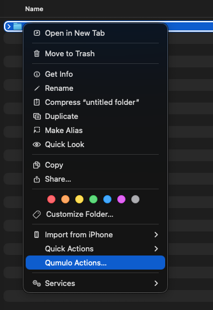
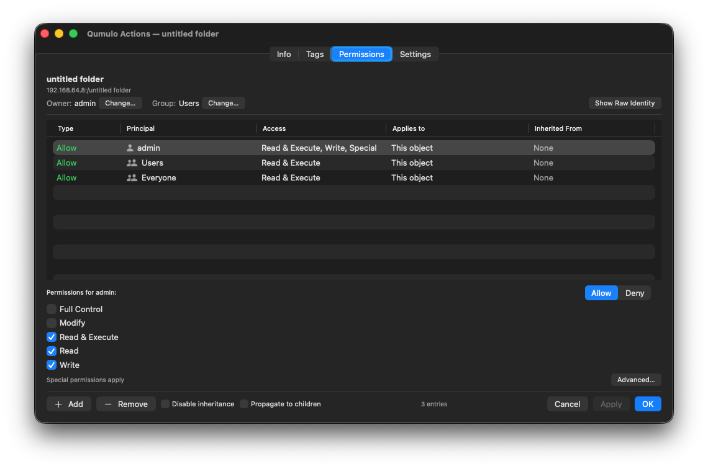
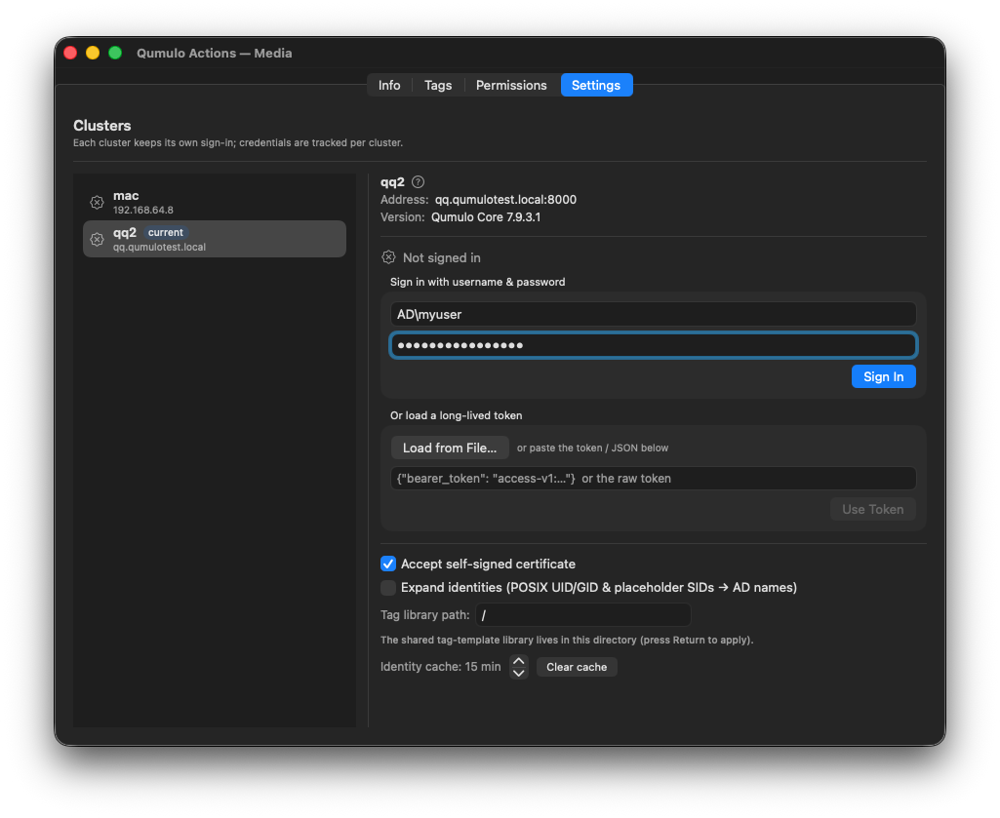

# Qumulo Actions — Install & User Guide

Qumulo Actions is a macOS app that lets you view and edit **tags**, **permissions**, and **file info**
for items on your mounted Qumulo SMB shares — directly from Finder's right‑click menu.

## Requirements

- macOS 14 (Sonoma) or later — Intel or Apple Silicon.
- A Qumulo SMB share mounted in Finder (appears under **Locations**).

---

## 1. Install the app

1. Double‑click the **Qumulo Actions** installer (the `.pkg` file you downloaded).
2. Follow the installer prompts. You'll be asked for an **administrator password** — it installs to
   **/Applications** for all users of the Mac.
3. When it finishes, **Qumulo Actions** and **Uninstall Qumulo Actions** are in your Applications
   folder. (The uninstaller is optional: click **Customize** at the *Installation Type* step to leave
   it out.)

If a cluster is on your **local network** (for example, a test cluster in a virtual machine on this
Mac), macOS may ask whether Qumulo Actions can **find devices on your local network**. Click
**Allow**. Without it, the Finder menu won't appear on that cluster's shares.

## 2. Turn on the Finder extension

macOS requires you to enable the extension by hand — an installer isn't allowed to do it for you.

1. Open **System Settings → General → Login Items & Extensions**. (Shortcut: type **extensions** in
   the System Settings search field.)
2. Under **Extensions**, find **QumuloActions** and click its **ⓘ** button.
3. In the **QumuloActions Extensions** window, turn on **File Provider**, then click **Done**.

   

4. Close System Settings.

On older macOS versions the extensions are grouped by type instead of by app: open the **Finder** (or
**Added Extensions**) group and turn on **Qumulo Actions Finder Sync**.

## 3. Restart Finder (if the menu doesn't show up)

If you don't see **Qumulo Actions** when you right‑click a file after enabling the extension,
relaunch Finder:

- Hold **Option**, right‑click the **Finder** icon in the Dock, and choose **Relaunch**.

(Signing out and back in — or restarting the Mac — also works.)

---

## 4. Open Qumulo Actions

1. In Finder, open a **mounted Qumulo share** and select one or more files or folders.
2. **Right‑click** the selection and choose **Qumulo Actions…**

   

3. A window opens with four tabs: **Info · Tags · Permissions · Settings**.

   

> The menu only appears on Qumulo shares — not on other drives or network shares.

## 5. Sign in to your cluster

You need to sign in before you can read or change tags and permissions. Do it on the **Settings** tab:

1. Open the **Settings** tab. Your cluster is listed automatically (discovered from the mounted share).
2. Select the cluster.
3. **If your cluster uses a self‑signed certificate,** first turn on **Accept self‑signed certificate**
   for it. (Leave it off for clusters with a CA‑signed certificate.)
4. Sign in one of two ways:
   - **Username and password** — your Qumulo / Active Directory account, or
   - **Long‑lived access token** — click **Load from File…** or paste the token.

   

5. A green check mark means you're signed in. Each cluster keeps its own separate sign‑in.

---

## What each tab does

| Tab | What it's for |
|-----|---------------|
| **Info** | Key details about the selected item — type, size, owner and group, and timestamps. For a folder, it also shows totals for everything inside it. |
| **Tags** | View and edit the item's custom tags (name/value pairs). Use **Add Tag** to add a row and **OK**/**Apply** to save. For a single folder you also get **Folder Contents…** and **Search…** (below). A **templates** menu saves and re‑applies named sets of tags. |
| **Permissions** | View and edit the item's permissions — owner/group and the list of allow/deny entries. Tick **Propagate to children** to push a folder's permissions to everything inside it, then **Apply**. |
| **Settings** | Manage clusters and sign‑ins: sign in/out per cluster, **Accept self‑signed certificate**, the tag‑template library location, and identity‑display options. |

## Common tasks

- **Tag a file** — right‑click it → **Qumulo Actions → Tags** → **Add Tag** → enter a name and value → **OK**.
- **Tag everything in a folder** — right‑click the folder → **Tags → Folder Contents…** → choose the tags
  and options (which item types, how deep) → **Apply**.
- **Find tagged items** — right‑click a folder → **Tags → Search…** → type a term, choose **Keys**,
  **Values**, or **both**, and **Contains**/**Exact** → **Search** → select results → **Reveal in Finder**.
- **Change permissions** — right‑click → **Permissions** → edit the entries (or tick **Propagate to
  children**) → **Apply**.

## Troubleshooting

- **No "Qumulo Actions" menu** — confirm the extension is enabled (Step 2) and relaunch Finder (Step 3).
- **Menu missing on one cluster only, and it's on your local network** (e.g. a VM on this Mac) — open
  **System Settings → Privacy & Security → Local Network** and turn on both **Qumulo Actions** and
  **QumuloActionsFinderSync**. The menu appears within a few minutes, or immediately after
  relaunching Finder. The log shows `Probe … FAILED … Local Network privacy` when this is the cause
  (see *Review logs in Console*).
- **"Turn on 'Accept self‑signed certificate' for this cluster…"** — the cluster uses a certificate
  this Mac doesn't trust (typically self‑signed). Turn on **Accept self‑signed certificate** for that
  cluster in **Settings** (it's just below the message), then try again.
- **"Sign in on the Settings tab first"** — you aren't signed in to that cluster yet; see Step 5.
- **Qumulo Actions is listed several times in Login Items & Extensions** — macOS lists every copy of
  the app it finds on disk (downloads, the Trash, old versions). Run **Uninstall Qumulo Actions** to
  remove them all, then reinstall.

---

## Uninstall Qumulo Actions

**Uninstall Qumulo Actions** (in Applications) removes the app completely, including extra copies
you may not know about.

1. Open **Applications → Uninstall Qumulo Actions**.
2. Review the list of copies it found. Each shows its version and what will happen to it. Untick
   any you want to keep.
3. Leave **Also remove my settings and saved cluster sign‑ins** ticked for a full removal, or untick
   it to keep your sign‑ins and settings (for example, before reinstalling).
4. Click **Uninstall**. Enter an administrator password if asked — at most once.
5. Read the report. A ✓ is a completed step; ⓘ is a note; ⚠ needs attention.

**What it removes:** the app and its Finder extension (every copy, including the old *QumuloTags*
name), their entries in **Login Items & Extensions**, and the installer receipts. With the box
ticked, it also removes your settings, saved sign‑ins and caches. Qumulo Actions is quit, but Finder
keeps running, so file copies in progress aren't interrupted. The uninstaller removes itself when
nothing was kept.

**Good to know:**
- **Cancelling the password prompt changes nothing.** Every copy is left installed and working.
- **One folder may be left behind:** `~/Library/Containers/com.qumulo.actions.app.FinderSync`. macOS
  protects it, it holds no sign‑in data, and the report says so. Drag it to the Trash in Finder if
  you want it gone.
- **Settings are per user.** The uninstaller removes the settings and sign‑ins of the account that
  runs it. To clear another account's, sign in as that user and delete
  `~/Library/Application Support/QumuloActions` and
  `~/Library/Preferences/com.qumulo.actions.app.plist`.
- **No uninstaller in Applications?** Run the Qumulo Actions installer again, click **Customize**, and
  tick only **Uninstall Qumulo Actions**.

---

## Review logs in Console

Qumulo Actions records what it does — cluster checks, loads, sign‑in and certificate problems,
uninstall steps — in the macOS system log. Use it to find out why something didn't work, or to
send details to support. Passwords and tokens are never logged; cluster names, share paths and
error messages are.

1. Open **Console** (Applications → Utilities).
2. Select this Mac under **Devices** in the sidebar, then click **Start streaming**.
3. In the search field, type `com.qumulo.actions`, then choose **Subsystem** from the menu that
   appears. The search becomes a token: *Subsystem: com.qumulo.actions*.
4. Reproduce the problem (for a missing menu, relaunch Finder). Messages appear as they happen.

To narrow the view, add a second token for a **Category**:

| Category | What it covers |
|----------|----------------|
| `finder-sync` | The Finder menu: which shares are recognized as Qumulo, and why not |
| `tls` | Certificates refused because **Accept self‑signed certificate** is off |
| `tags` / `acl` | Loading and saving tags and permissions |
| `app` | The app opening from Finder |
| `uninstaller` | Each uninstall step and its result |

Messages worth looking for:
- `Probe <server>: Qumulo cluster (Qumulo Core …)`: the cluster was recognized; its shares get the menu.
- `Probe <server> FAILED …`: the cluster couldn't be reached. The rest of the line says why, e.g. a
  timeout, or **Local Network privacy** (see *Troubleshooting*).
- `Refused <server>'s TLS certificate…`: turn on **Accept self‑signed certificate** for that cluster.

Console only shows messages from the moment you start streaming. To save the last hour to a file
for support, run this in **Terminal**:

```
log show --last 1h --info --predicate 'subsystem == "com.qumulo.actions"' > ~/Desktop/qumulo-actions-log.txt
```

(To see every right‑click as it happens, turn on **Action → Include Debug Messages** in Console.)
